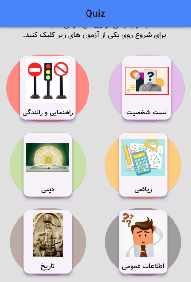
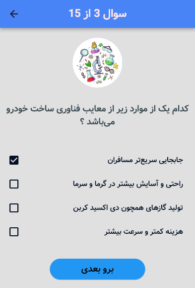
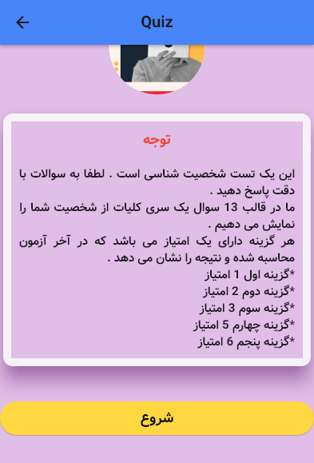
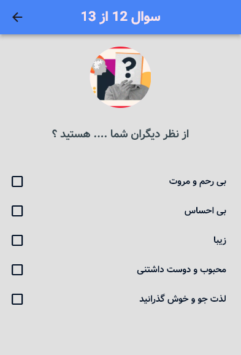
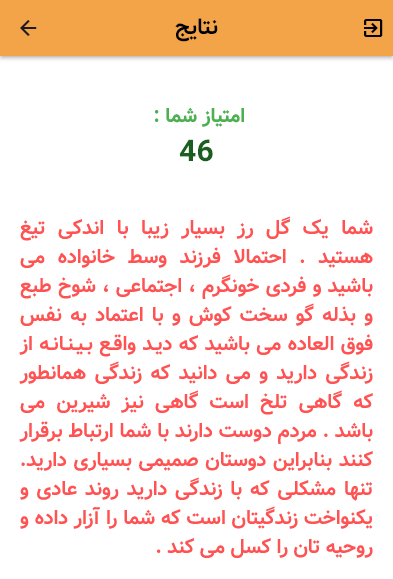

# 🧠 Flutter Quiz

A Flutter-based quiz application designed to provide an interactive and engaging quiz experience across multiple categories. 📱✨

Users can choose different quiz categories, answer questions, and view their results at the end of each quiz.

---

## ✨ Features

- 🏠 Clean and simple home screen
- 📚 Multiple quiz categories
- 🧠 Category-based questions
- 📝 Interactive quiz screens
- ✅ Answer selection
- 📊 Result screens
- 🎯 Score calculation
- 🎨 Custom UI and typography
- 📱 Responsive Flutter interface
- ⚡ Fast and lightweight
- 🚀 Built with Flutter & Dart

---

## 📚 Quiz Categories

The application includes several different quiz categories:

- 🕌 Religious Quiz
- 🚗 Driving Quiz
- ⚽ Football Quiz
- ➗ Math Quiz
- 🔬 Science Quiz
- 📖 General Knowledge Quiz
- 📜 History Quiz
- 📝 Test Preparation Quiz

---

## 🛠️ Tech Stack

| Technology | Usage |
|---|---|
| 💙 Flutter | Cross-platform mobile development |
| 🎯 Dart | Programming language |
| 🎨 Material Design | User interface |
| 🧩 Font Awesome | Icons |
| 📱 Responsive UI | Different screen sizes |

---

## 📂 Project Structure

```text
lib/
├── data/
│   └── question.dart
│
├── dini/
│   ├── data_dini.dart
│   ├── quiz_dini.dart
│   └── result_dini.dart
│
├── driving/
│   ├── data_driving.dart
│   ├── home_driving.dart
│   ├── quiz_driving.dart
│   └── result_driving.dart
│
├── football/
│   ├── data_football.dart
│   ├── quiz_football.dart
│   └── result_football.dart
│
├── math/
│   ├── data_math.dart
│   ├── quiz_math.dart
│   └── result_math.dart
│
├── olom/
│   ├── data_olom.dart
│   ├── quiz_olom.dart
│   └── result_olom.dart
│
├── omomi/
│   ├── data_omomi.dart
│   ├── quiz_omomi.dart
│   └── result_omomi.dart
│
├── tarikh/
│   ├── data_tarikh.dart
│   ├── quiz_tarikh.dart
│   └── result_tarikh.dart
│
├── testsh/
│   ├── data_test.dart
│   ├── home_test.dart
│   ├── quiz_test.dart
│   └── result_test.dart
│
├── home.dart
└── main.dart
````

---

## 🖼️ Screenshots

<div align="center">

<table>
<tr>
<td></td>
<td></td>
<td></td>
</tr>
<tr>
<td></td>
<td></td>
<td></td>
</tr>
</table>

</div>

---

## 🚀 Getting Started

### 1️⃣ Clone the repository

```bash
git clone https://github.com/MobinaFetrati/quiz.git
```

### 2️⃣ Navigate to the project

```bash
cd fllutter-quiz
```

### 3️⃣ Install dependencies

```bash
flutter pub get
```

### 4️⃣ Run the application

```bash
flutter run
```

---

## 🎯 Project Purpose

This project was developed to practice and demonstrate:

* 💙 Flutter application development
* 🎯 Dart programming
* 🧠 Quiz application logic
* 🗂️ Organizing multiple quiz categories
* 🔄 Managing questions and answers
* 📊 Calculating and displaying quiz results
* 🎨 Building clean mobile interfaces
* 📱 Developing cross-platform applications

---

## 👩‍💻 Developer

**Mobina Fetrati**

Flutter Developer | Mobile Application Developer

🔗 [GitHub](https://github.com/MobinaFetrati)

---

⭐ If you find this project interesting, feel free to explore the repository!

```
```
